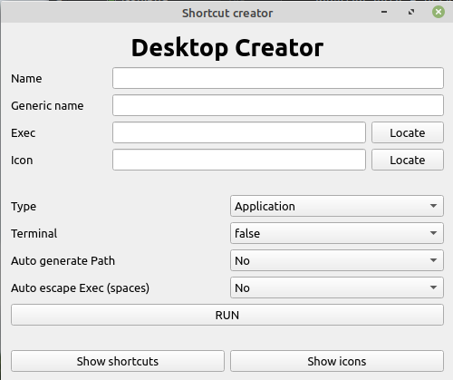

# desktopcreator

A simple linux desktop files creator for simple shortcuts or installing `.desktop` files.


# Interface



# Details

* **Name**: Short name of the desktop, will be used many times. Make it short and simple.
* **Generic** name: More details about your app
* **Exec**: path to executable. Better to be without spaces or specific symbols.
* **Icon**: path to Icon, should be squared and size 256x256 or 512x512.

# Notes

Application will write in these folders

* `~/.local/share/applications/`
* `~/.local/share/icons/hicolor`

# Example

```buildoutcfg
[Desktop Entry]
Name=faf
GenericName=Forged alliance forever
Type=Application
Exec=/home/light/Downloads/downlords-faf-client-1.5.0/downlords-faf-client
Path=/home/light/Downloads/downlords-faf-client-1.5.0/
Icon=faf
Terminal=false
```

# Bonus Todo

* MimeType
* Categories

# Documentation
https://specifications.freedesktop.org/desktop-entry-spec/latest/

https://specifications.freedesktop.org/desktop-entry-spec/latest/ar01s06.html

# Installation

`pip install -r requirements.txt`

`python3 creator.py`